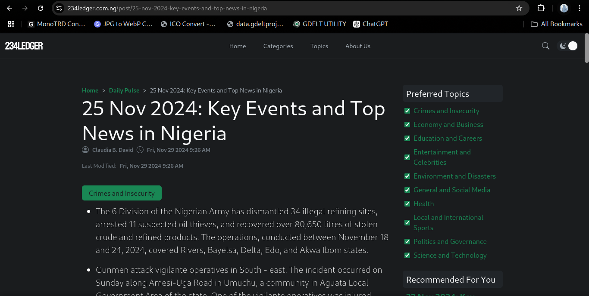

# 234Ledger

This is public snapshot of 234Ledger's source codes. 234Ledger is a news aggregator platform for the Nigerian's space. It is currently offline.

## Directory Structure

1. **adm**  
    The admin panel front-end application made with Angular 18 and is meant to be hosted on its own server.

2. **site16**  
    The actual application made with Angular 16 and SSR. Also contains API endpoints for the admin panel.

3. **shared**  
    An extra directory to share schema between `site16` and `adm`.

4. **db**  
    A mysql export of the database.

## Caution  

Running this may require additional setup and processes which are not included in this public repository. This public snaption is preferred READ-ONLY.

## Conclusion

Please contact me for any inquiry.